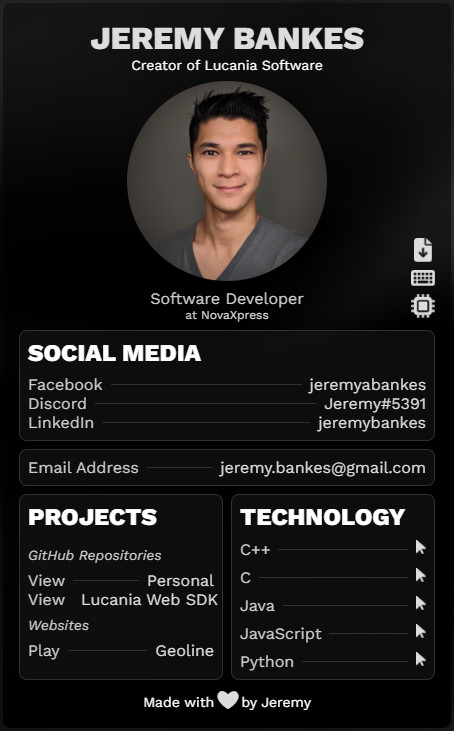

# You've found yourself on the source code for Jeremy's portfolio.

<table>
<tbody>
    <tr>
        <td>
            
        </td>
        <td>
            Some interesting notes.
            <ul>
                <li>This portfolio is written in pure HTML, CSS & JavaScript using my custom suite of [Lucania libraries](https://github.com/lucania-software), most of which are written in TypeScript.</li>
                <li>The wallpaper is using a canvas with a WebGL rendering context with some custom shader code! It can be viewed & tinkered with on [Shadertoy](https://www.shadertoy.com/view/cllyDs).</li>
                <li>Everything else is just pure HTML using my [lux](https://github.com/lucania-software/lux) styling library, plus some custom CSS rules to make things look _✧ fancy ✧_.</li>
            </ul>`
        </td>
    </tr>
</tbody>
</table>
